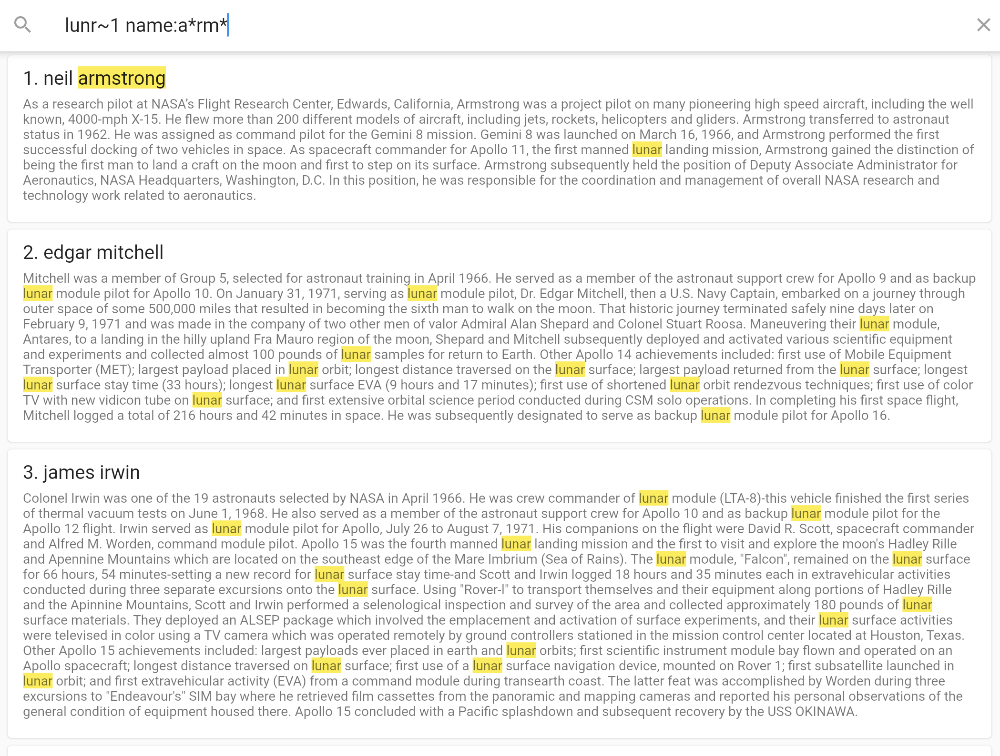

# lunr_demo

A simple demo of lunr running in flutter web as a github page.

The fields are name and body, so be sure to try out the features

Visit [lunr_demo.hornmicro.com](https://lunr_demo.hornmicro.com/) to see this working

# Screenshot

